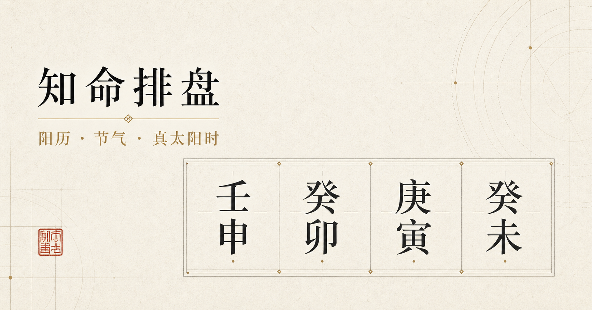

# Fate8 · Chinese Metaphysics Charting

English | [简体中文](./README.md)




Fate8 is a modular Chinese metaphysics charting project built on one shared calendrical core. It currently provides BaZi, Da Liu Ren, Chai-Bu Qi Men Dun Jia, and reverse Four Pillars lookup. The Web application, CLI, and HTTP APIs consume the same time correction, solar-term, and Four Pillars result and can return JSON, formatted plain text, downloadable files, or reusable ESM objects.

> This version is intended for traditional-culture research, software integration, and chart-interface prototyping. Dates close to a solar-term, day, or double-hour boundary—and historical dates before 1582—should be checked against high-precision ephemerides and the rules of the tradition being followed.

## Features

| Module | Capabilities |
| --- | --- |
| BaZi input | Gregorian date/time, Chinese date strings, three-level Chinese administrative divisions, direct longitude input, true solar time, 23:00/00:00 day boundary |
| BaZi chart | Four Pillars, Ten Gods, Six Kin, hidden stems, Na Yin, void branches, Twelve Growth Stages, seasonal strength, Shen Sha, luck pillars, and annual years |
| BaZi graph | Eight stem/branch nodes, orthogonal adjacency paths, three-node highlighting, and an eight-cell relationship matrix |
| Reverse lookup | Searches real Gregorian matches for a Four Pillars combination between CE 1000 and 2100 |
| Da Liu Ren | Middle-qi month-general switching, manual month general, twelve-palace heaven plate, heavenly generals, Shen Sha, right-to-left Four Lessons, and Three Transmissions |
| Chai-Bu Qi Men | Solar-term setup, Fu Tou, three yuan/hou, yin/yang nine configurations, Xun Shou, Chief Star/Door, and a full nine-palace chart with growth stages |
| Integration | Separate Web tabs, Node/ESM, CLI, HTTP API, JSON, formatted TXT, and downloadable files |

The Web UI uses a modern Chinese ink-landscape visual language. BaZi, reverse lookup, Liu Ren, and Qi Men are separated into dedicated tabs. Input can collapse after chart generation or through the Suspend control, and every detailed chart can copy its formatted text version.

## Architecture

```text
Gregorian time / location / configuration
                  │
                  ▼
        four-pillars.mjs       calendar, correction, pillars, luck start
                  │
                  ▼
       metaphysics-core.mjs    solar terms, month general, Qi Men setup
                  │
                  ├──────────────────┐
                  ▼                  ▼
            liu-ren.mjs         qi-men.mjs       domain modules
                  └────────┬─────────┘
                           ▼
               simple-chart.mjs                 stable JSON / TXT layer
                  ┌────────┼──────────┐
                  ▼        ▼          ▼
                Web UI    CLI      HTTP API
```

The central rule is simple: time is calculated once. BaZi presentation, Liu Ren, and Qi Men consume the `four-pillars` result instead of reinterpreting Gregorian input independently.

See [Architecture](./docs/architecture.md) for module boundaries and dependency rules.

## Quick Start

### Requirements

- Node.js `22.13.0` or newer
- npm

### Install and run

```bash
git clone https://github.com/wongpakyim/Fate8.git
cd Fate8
npm install
npm run dev
```

Open `http://localhost:3000`.

### Production build

```bash
npm run build
npm run start
```

## CLI / Scripts

### Full lightweight chart

```bash
# JSON
npm run chart:simple -- --input examples/birth.json --format json

# Formatted text: Liu Ren heaven ring + Four Lessons, Qi Men nine-palace grid
npm run chart:simple -- --input examples/birth.json --format text

# Write to a file
npm run chart:simple -- --input examples/birth.json --format text --out simple-chart.txt
```

### Individual modules

```bash
# Four Pillars and luck start only
npm run bazi -- --mode pillars --datetime "1992-03-15 14:30" --longitude 113.27

# Shared metaphysics core
npm run chart:core -- --datetime "1992-03-15 14:30" --longitude 113.27 --format text

# Da Liu Ren, automatically switching the month general at middle qi
npm run bazi -- --mode liuren --datetime "1992-03-15 14:30" --longitude 113.27 --format text

# Da Liu Ren with a manual Zi month general
npm run bazi -- --mode liuren --month-general 子 --input examples/birth.json --format text

# Chai-Bu Qi Men nine-palace chart
npm run bazi -- --mode qimen --datetime "1992-03-15 14:30" --longitude 113.27 --format text

# Reverse Four Pillars lookup
npm run bazi -- --reverse "壬申 癸卯 庚寅 癸未" --start 1000 --end 2100
```

See the [script usage guide](./docs/simple-chart-script-usage.md) for all parameters, stdin, and file examples.

## ESM Usage

```js
import { calculateFourPillars } from "./lib/four-pillars.mjs";
import { buildSimpleChart, formatSimpleChartText } from "./lib/simple-chart.mjs";
import { buildBaziChart } from "./lib/chart-presentation.mjs";

const calculation = calculateFourPillars({
  solarTime: "1992-03-15 14:30",
  longitude: 113.27,
  sex: "male",
});

const simple = buildSimpleChart(calculation);
const bazi = buildBaziChart(calculation);

console.log(calculation.fourPillars.text);
console.log(JSON.stringify(simple, null, 2));
console.log(formatSimpleChartText(simple));
console.log(bazi.luck.cycles);
```

## HTTP API

| Endpoint | Result |
| --- | --- |
| `GET /api/pillars` | Four Pillars and luck-start facts |
| `GET /api/core` | Shared solar-term, month-general, and Qi Men setup data |
| `GET /api/simple` | Complete lightweight chart for downstream applications |
| `GET /api/bazi` | Detailed BaZi result |
| `GET /api/liuren` | Da Liu Ren result |
| `GET /api/qimen` | Chai-Bu Qi Men result |

Examples:

```text
GET /api/simple?solarTime=1992-03-15%2014:30&longitude=113.27
GET /api/liuren?solarTime=1992-03-15%2014:30&longitude=113.27&format=text
GET /api/qimen?solarTime=1992-03-15%2014:30&longitude=113.27&format=file
```

- No `format`: JSON.
- `format=text`: UTF-8 plain text.
- `format=file`: downloadable TXT.
- The endpoints also accept POST JSON payloads.

## Configuration

Defaults live in [`config/bazi.config.json`](./config/bazi.config.json):

| Option | Values / meaning |
| --- | --- |
| `dayBoundary` | `23` for Zi-hour day change; `24` for midnight |
| `solarTimeMode` | `apparent` true solar time; `mean` mean solar time; `none` no correction |
| `timezoneOffset` | UTC offset, default `+8` |
| `reverseSearch` | Reverse-lookup range and result limit |
| `liuRen.monthGeneralMethod` | `middle-qi` by default |
| `qiMen.method` | `chai-bu` by default |

## Testing

```bash
# Production build + complete automated test suite
npm test

# Static checks
npm run lint

# Text-chart tests only
node --test tests/text-charts.test.mjs
```

Coverage includes input parsing, day-boundary modes, reverse lookup, architecture boundaries, Liu Ren month generals and lessons/transmissions, Qi Men setup and palaces, CLI text charts, HTTP APIs, and server rendering. See [Text Chart Test Cases](./docs/simple-chart-test-cases.md).

## Repository Layout

```text
app/                    Web pages, components, and API routes
config/                 Charting conventions
data/                   Chinese administrative-division data
docs/                   Architecture, scripts, and test guides
examples/               Sample input
lib/                    Calendar core and domain modules
scripts/                CLI entry point
tests/                  Node test suite
public/                 Ink-themed site assets
```

## Accuracy and Scope

- The implementation uses a proleptic Gregorian calendar and approximate apparent-solar-longitude calculations.
- Results near solar-term, day, or double-hour boundaries require verification.
- Dates before 1582 are interpreted in the proleptic Gregorian calendar; local historical calendars are not reconstructed.
- Different lineages may use different day boundaries, month-general rules, Qi Men setups, stem lodgings, or lesson/transmission methods.
- This project is for traditional-culture research and software-engineering practice. It is not medical, legal, investment, or life-decision advice.

## License

No open-source license is currently included. Do not assume permission to copy, modify, or redistribute the code without explicit authorization from the repository owner.
